# Scheduling

Scheduler é um componente do controplane que é responsavel por determinar um node para um pod rodar dentro.

## 1. Labels and Selectors

## 2. Taints and Tolerations

## 3. Node Selectors

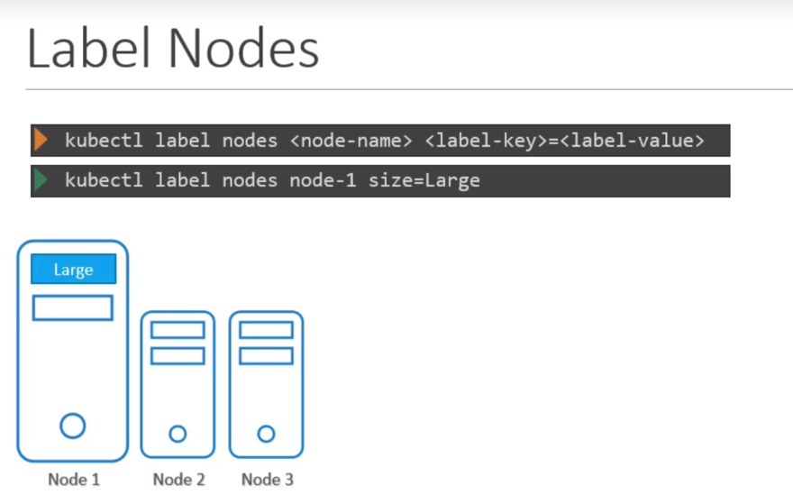

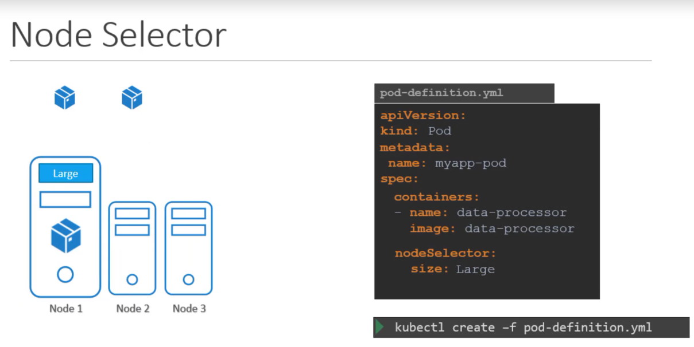

## 4. Node Affinity

## 5. Resources requirements and limits

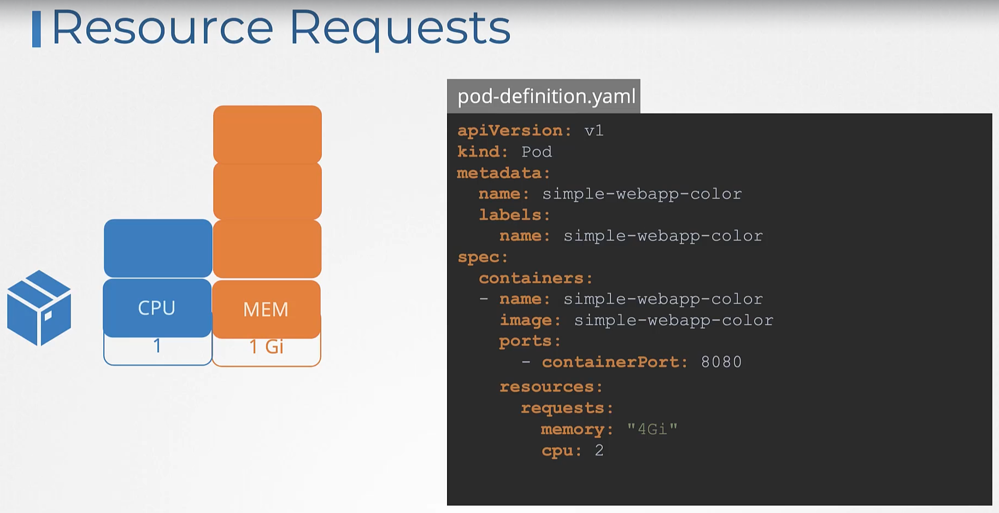

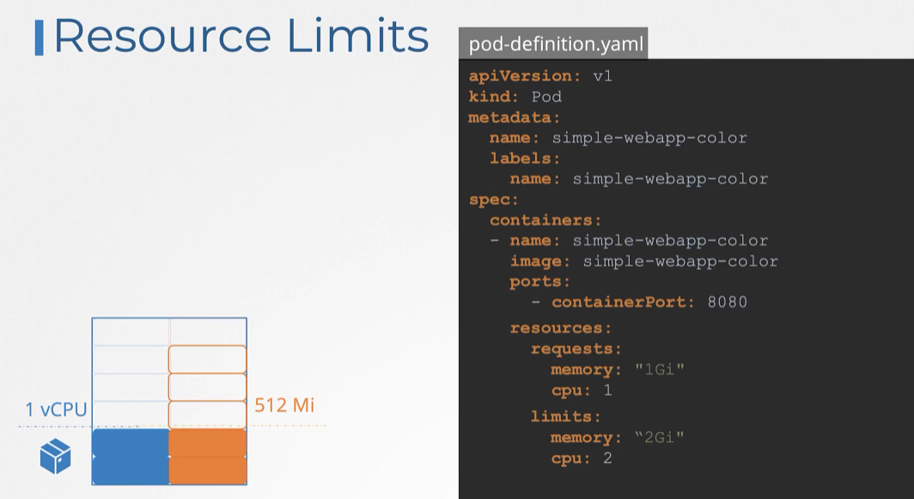

### Limit Range
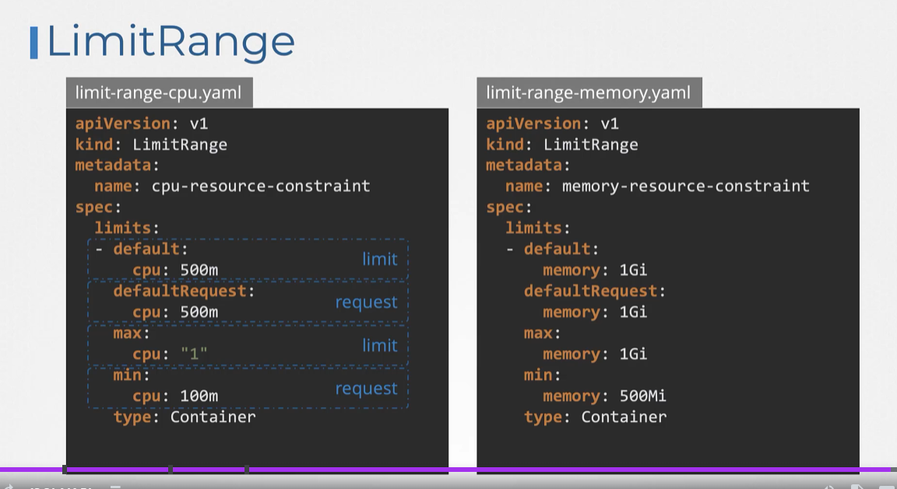

### Resource Quota
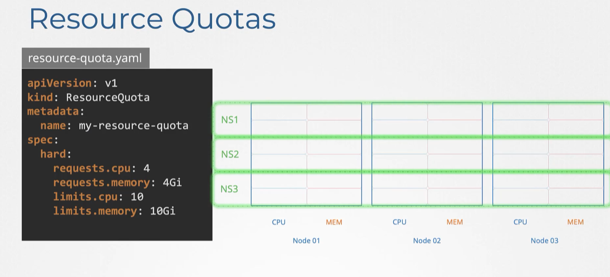

## 6. Daemon Sets

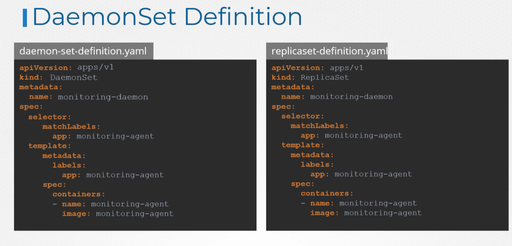

## 7. Static Pods

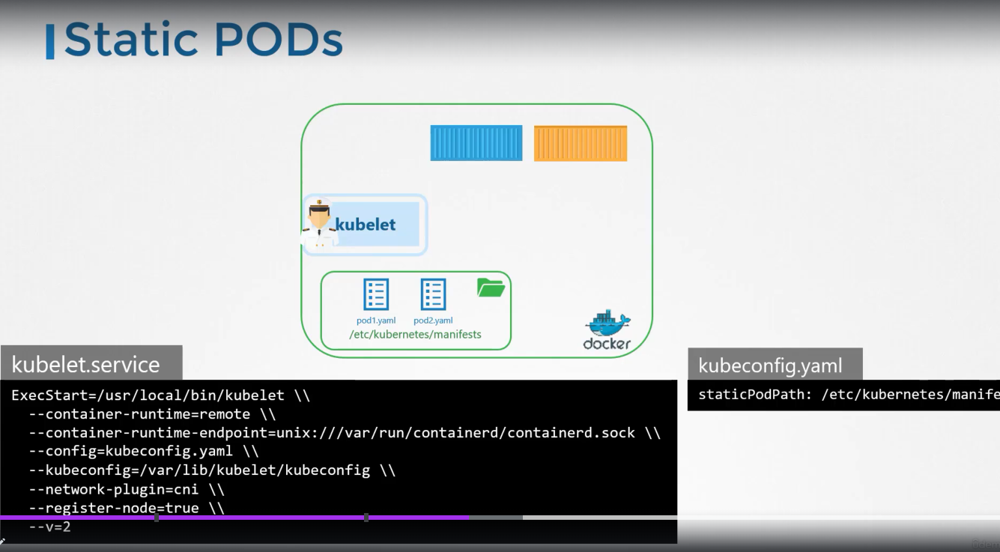

## 8. Multiple Schedulers

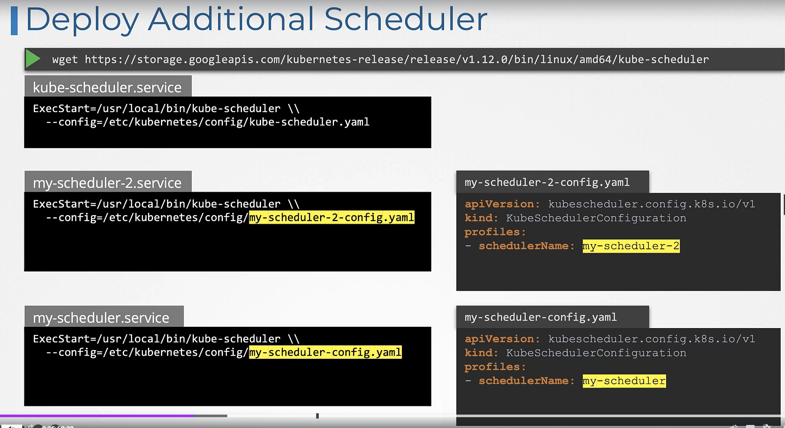

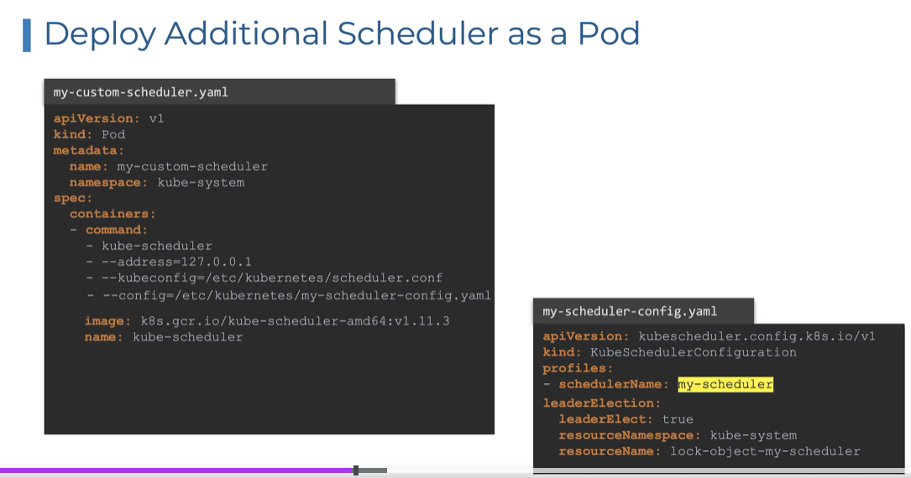

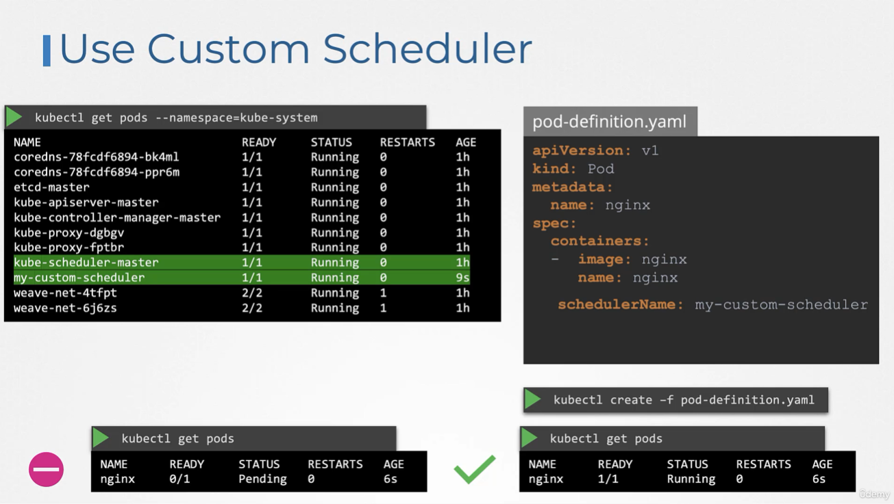

## 9. Configuring Scheduler Profiles

